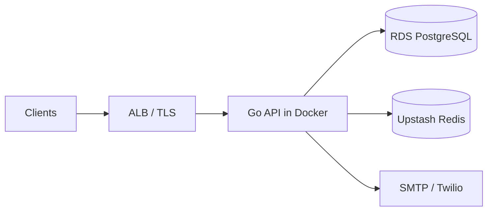

# Veterinary Clinic API

REST API for veterinary clinic operations—customers, pets, appointments, clinical sessions, payments, and notifications.

[](https://go.dev/)
[](https://github.com/gin-gonic/gin)
[](https://www.postgresql.org/)
[]()

---

## Table of contents

- [About](#about)
- [Features](#features)
- [Documentation](#documentation)
- [Tech stack](#tech-stack)
- [Architecture at a glance](#architecture-at-a-glance)
- [Prerequisites](#prerequisites)
- [Quick start](#quick-start)
- [Configuration](#configuration)
- [API overview](#api-overview)
- [Project structure](#project-structure)
- [Deployment](#deployment)
- [Testing](#testing)
- [Maintaining documentation](#maintaining-documentation)
- [Contributing](#contributing)
- [Security](#security)
- [License](#license)
- [Links](#links)

---

## About

Veterinary practices often juggle reception, clinical records, pet owner communication, and billing across disconnected tools. This project provides a **single Go API** with hexagonal architecture, type-safe PostgreSQL access via **sqlc**, and **Redis-backed JWT** sessions for a future client portal and staff apps.

Production data plane targets **Amazon RDS (PostgreSQL)** and **Upstash Redis**; the API ships as a **Docker** image ready for AWS ECS or EC2 behind an ALB.

| | |
|---|---|
| **Version** | 2.0.0 |
| **Status** | stable |
| **Primary API prefix** | `/api/v2` (most routes) |
| **Health check** | [GET /health](https://api.vet-clinic.example.com/health) (local: http://localhost:8000/health) |
| **OpenAPI (Swagger)** | http://localhost:8000/swagger/index.html when `ENABLE_SWAGGER=true` and not production |

---

## Features

- **JWT authentication & RBAC** — Register, activate, login, refresh, logout, 2FA hooks, password reset ([details](docs/project/generated/ProjectFeature.md#jwt-authentication--rbac))
- **Appointment scheduling** — Customer requests, employee assignments, admin search; overlap and hourly capacity rules ([details](docs/project/generated/ProjectFeature.md#appointment-scheduling--lifecycle))
- **Customers & employees** — Clinic CRUD with soft-delete and restore ([details](docs/project/generated/ProjectFeature.md#customers--employees-crud))
- **Docker & migrations** — Local full stack or API-only profile against cloud DB/Redis ([details](docs/project/generated/ProjectInfrastructure.md))

See [Project Features](docs/project/generated/ProjectFeature.md) for the full breakdown (pets, medical, payments status included).

---

## Documentation

Structured **YAML source** lives in `docs/project/source/` (matches `schema.ts`). **Human-readable docs** are generated into `docs/project/generated/`.

**Start here:** [Documentation hub](docs/project/generated/README.md) · [Short path](docs/generated/README.md)

### Documentation index

| Document | What you will find |
|----------|-------------------|
| [Overview](docs/project/generated/ProjectOverview.md) | Problem, solution, metrics, links |
| [Metadata](docs/project/generated/ProjectMetadata.md) | Project id, version, tech stack, URLs |
| [API schema](docs/project/generated/APISchema.md) | Endpoints, auth, rate limits, examples |
| [Architecture](docs/project/generated/ProjectArchitecture.md) | Layers, patterns, diagram, data flows |
| [Infrastructure](docs/project/generated/ProjectInfrastructure.md) | Docker, RDS, Upstash, AWS deploy target |
| [Features](docs/project/generated/ProjectFeature.md) | Feature cards, snippets, status per area |
| [Code showcase](docs/project/generated/ProjectCodeShowCase.md) | Curated code examples from the repo |

### Source vs generated

| Path | Purpose |
|------|---------|
| `docs/project/source/*.md` | Edit YAML frontmatter here |
| `docs/project/generated/*.md` | Read on GitHub / in the IDE (regenerate; do not edit by hand) |
| `docs/project/yaml_to_markdown.py` | Builds `docs/project/generated/` from source |
| `docs/project/source/schema.ts` | TypeScript contract for portfolio tools |

```bash
pip install pyyaml
python docs/project/yaml_to_markdown.py
```

Docker-specific setup: [docker/README.md](docker/README.md).

---

## Tech stack

- **Go 1.24** — monolith binary (`clinic-vet-api`)
- **Gin** — HTTP router and middleware
- **PostgreSQL** — pgx pool + **sqlc** generated queries
- **Redis** — go-redis (JWT / sessions)
- **golang-migrate** — `db/migrations/`
- **Swagger (swaggo)** — handler annotations → `docs/docs.go`
- **Twilio** & **SMTP** — notifications (configurable)
- **Docker** — multi-stage Alpine image (`docker/Dockerfile`)

---

## Architecture at a glance

Hexagonal layout: `internal/core` (domain), `internal/infrastructure` (HTTP, persistence), `internal/config` (bootstrap). Stateless API tasks can scale behind a load balancer; JWT validation does not require sticky sessions.



Full diagram, layers, and decisions: [ProjectArchitecture.md](docs/project/generated/ProjectArchitecture.md).

---

## Prerequisites

- **Go 1.24+**
- **Docker** & Docker Compose (recommended for local stack)
- **PostgreSQL** and **Redis** (included via `./docker/up-local.sh`, or cloud URLs in `.env`)
- **Python 3** + PyYAML (only to regenerate project docs)

---

## Quick start

### 1. Clone and configure

```bash
git clone https://github.com/alexisTrejo11/veterinary-clinic-api.git
cd veterinary-clinic-api
cp .env.example .env
# Edit DATABASE_URL, REDIS_URL, JWT_SECRET (32+ chars), etc.
```

### 2. Local full stack (Postgres + Redis + API)

From the repository root:

```bash
./docker/up-local.sh --build        # foreground
./docker/up-local.sh --build -d     # detached
```

| Service | URL |
|---------|-----|
| API | http://localhost:8000 |
| Health | http://localhost:8000/health |
| Swagger | http://localhost:8000/swagger/index.html (dev) |
| Postgres (host) | `localhost:5431` (default `POSTGRES_PUBLISHED_PORT`) |

Migrations run on API startup unless `SKIP_MIGRATIONS=true`.

### 3. Run on the host (without Docker)

```bash
# Start Postgres and Redis yourself, then:
export $(grep -v '^#' .env | xargs)
go run ./cmd/migrate    # optional: migrations only
go run .
```

### 4. Dev container (cloud RDS + Upstash)

Point `.env` at your RDS and Upstash URLs, then:

```bash
docker compose --env-file .env -f docker/compose.dev.yml up --build
```

See [ProjectInfrastructure.md](docs/project/generated/ProjectInfrastructure.md) and [docker/README.md](docker/README.md).

---

## Configuration

Copy [.env.example](.env.example) to `.env`. Never commit `.env`.

| Variable | Description |
|----------|-------------|
| `DATABASE_URL` | PostgreSQL host URL (`jdbc:postgresql://` prefix optional) |
| `DATABASE_USER` / `DATABASE_PASSWORD` | Credentials merged into connection |
| `REDIS_URL` | Redis URL (`redis://` or `rediss://` for TLS) |
| `JWT_SECRET` | Signing key (minimum 32 characters) |
| `JWT_EXPIRATION_TIME` / `REFRESH_TOKEN_EXPIRY` | Token lifetimes |
| `SERVER_PORT` / `SERVER_HOST` | HTTP bind (default `8000` / `0.0.0.0`) |
| `ENVIRONMENT` | `development` or `production` |
| `ENABLE_SWAGGER` | Swagger UI (disabled in production by default) |
| `CORS_ALLOW_ORIGINS` | Allowed frontend origins |
| `RATE_LIMIT_*` | Global rate limiter toggles |
| `SMTP_*` / `TWILIO_*` | Email and SMS notifications |

RDS hosts (`*.rds.amazonaws.com`) get `sslmode=require` automatically when parsing `DATABASE_URL`.

---

## API overview

Base URL (local): `http://localhost:8000`  
Base URL (production placeholder): `https://api.vet-clinic.example.com`

Authentication: `Authorization: Bearer <access_token>` on protected routes.

| Area | Base path | Doc |
|------|-----------|-----|
| Health | `GET /health` | [APISchema](docs/project/generated/APISchema.md#service) |
| Auth (public) | `/api/v2/auth/` | [APISchema — auth](docs/project/generated/APISchema.md#auth) |
| Auth (session) | `/auth/` (logout, refresh, 2FA) | [APISchema — auth](docs/project/generated/APISchema.md#auth) |
| Profile | `/api/v2/profile/` | [APISchema](docs/project/generated/APISchema.md) |
| Users | `/users/` | [APISchema](docs/project/generated/APISchema.md) |
| Customers | `/api/v2/customers/` | [APISchema](docs/project/generated/APISchema.md#customers) |
| Employees | `/api/v2/employees/` | [APISchema](docs/project/generated/APISchema.md#employees) |
| Appointments | `/api/v2/me/appointments/`, `/api/v2/appointments/`, … | [APISchema — appointments](docs/project/generated/APISchema.md#appointments) |
| Notifications | `/api/v2/me/notifications`, `/api/v2/notifications` | [APISchema — notifications](docs/project/generated/APISchema.md#notifications) |
| Medical | `/api/v2/medical/`, `/api/v2/me/medical/` | [APISchema — medical](docs/project/generated/APISchema.md#medical) |
| Pets / payments / addresses | Planned (handlers exist) | [APISchema](docs/project/generated/APISchema.md) |

Full endpoint list with request/response examples: [APISchema.md](docs/project/generated/APISchema.md).

---

## Project structure

```
veterinary-clinic-api/
├── main.go                      # Entrypoint, middleware, health
├── cmd/migrate/                 # Host-side migration runner
├── internal/
│   ├── core/                    # Domain (auth, pets, appointments, …)
│   ├── infrastructure/http/   # Handlers, router, DTOs
│   ├── infrastructure/persitence/
│   ├── config/                  # Settings, Redis, bootstrap
│   └── middleware/              # Auth, CORS, audit, rate limit
├── db/migrations/               # SQL migrations
├── sqlc/                        # Generated query code
├── docs/
│   ├── docs.go                  # Swagger bundle
│   └── project/
│       ├── source/              # YAML doc sources
│       ├── generated/           # Generated Markdown (read these)
│       └── yaml_to_markdown.py
├── docker/                      # Dockerfile, compose, up-local.sh
├── scripts/                     # entrypoint, URL parsers
├── .env.example
└── go.mod
```

---

## Deployment

**Live today:** RDS PostgreSQL and Upstash Redis via `DATABASE_URL` and `REDIS_URL`.

**Next step (documented, not automated in repo):** Build `docker/Dockerfile` → push to ECR → run on **ECS Fargate** behind an **ALB** with health check `GET /health`. Alternative: EC2 + `docker/compose.dev.yml`.

Checklist and cost placeholders: [ProjectInfrastructure.md](docs/project/generated/ProjectInfrastructure.md).

```bash
# Example: API-only container against cloud DB/Redis
docker compose --env-file .env -f docker/compose.dev.yml up --build -d
```

---

## Testing

```bash
go test ./...
```

Add focused tests under the same package as the code under test (`internal/...`).

---

## Maintaining documentation

1. Edit YAML frontmatter in `docs/project/source/<Section>.md` (align with `docs/project/source/schema.ts`).
2. Run `python docs/project/yaml_to_markdown.py`.
3. Commit both `docs/project/source/` and `docs/project/generated/` so GitHub shows docs without running the script.

Notes below the closing `---` in source files appear as **Additional notes** in generated Markdown.

---

## Contributing

1. Fork the repository
2. Create a feature branch (`git checkout -b feature/my-change`)
3. Commit with clear messages
4. Open a pull request against `main`

Keep changes focused; match existing patterns in `internal/core` and handlers.

---

## Security

- Store secrets in `.env` or a secrets manager—never in git.
- Use a strong `JWT_SECRET` (32+ characters) and restrict `CORS_ALLOW_ORIGINS` in production.
- Do not run demo seed migration `000007_insert_demo_data` on production databases.

Report vulnerabilities privately via [GitHub Security Advisories](https://github.com/alexisTrejo11/veterinary-clinic-api/security/advisories/new) for this repository.

---

## License

No license file is included yet. Add a `LICENSE` file before distributing or publishing the package.

---

## Links

| Resource | URL |
|----------|-----|
| Repository | https://github.com/alexisTrejo11/veterinary-clinic-api |
| **Documentation hub** | [docs/project/generated/README.md](docs/project/generated/README.md) · [docs/generated](docs/generated/README.md) |
| Overview | [docs/project/generated/ProjectOverview.md](docs/project/generated/ProjectOverview.md) |
| API reference (generated) | [docs/project/generated/APISchema.md](docs/project/generated/APISchema.md) |
| Health (placeholder) | https://api.vet-clinic.example.com/health |
